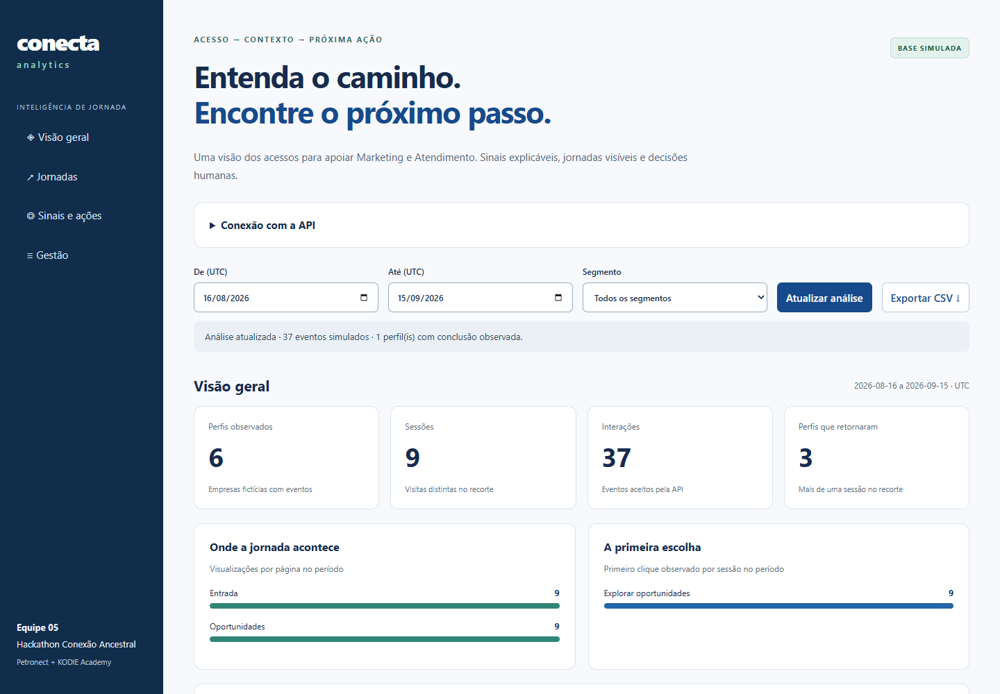
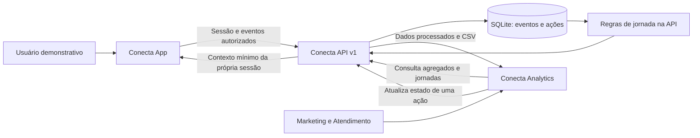

# Conecta Analytics

## Integração atualizada

O painel agora consome os sinais v2 da API, mostra a referência histórica e informa se cada sinal continua ativo hoje. A edição fica bloqueada para sinais inativos e no modo público. O CSV mantém os filtros da análise exibida. Atualize a API antes do painel; consulte o [guia de integração](docs/INTEGRATION.md).

### Entenda o caminho. Encontre o próximo passo.

Frontend administrativo do Conecta, desenvolvido pela Equipe 05 para o Hackathon Conexão Ancestral, **Petronect + KODIE Academy**. Apresenta os eventos processados pela API em uma experiência voltada a Marketing, Atendimento e gestão.

> **Dados simulados e regras transparentes.** O painel consulta o backend real do protótipo; não usa números aleatórios ou gráficos desconectados da API. “Concluir uma ação” registra o estado de trabalho e não comprova reengajamento nem envia comunicação.

**Explore:** [Arquitetura](docs/ARCHITECTURE.md) · [Contrato da API](docs/API.md) · [Dados e métricas](docs/DATA-MODEL.md) · [Execução integrada](docs/INTEGRATION.md) · [Produto e identidade](docs/PRODUCT.md) · [Roadmap](docs/ROADMAP.md) · [Contribuição](CONTRIBUTING.md) · [Segurança](SECURITY.md) · [Verificação](docs/VERIFICATION.md)



## Executar

Com Node.js 24, execute npm ci e npm start. Abra **http://127.0.0.1:8081** e informe o endereço da API. No modo local de escrita, use ADMIN_TOKEN do .env do backend. No modo público de leitura, o token é dispensado e a gestão fica desativada. A senha digitada é apagada do campo após a conexão; o token fica somente na memória da página.

Inicie o backend e a base simulada seguindo o [guia integrado](docs/INTEGRATION.md). Não existe aplicação hospedada automaticamente pela publicação no GitHub.

## O desafio e a nossa resposta

O **Hackathon Conexão Ancestral**, da **Petronect**, com execução da **KODIE Academy**, propõe identificar os acessos ao Portal Petronect e usar esse conhecimento para apoiar o reengajamento de usuários. O material de abertura descreve uma lacuna entre contar cliques e compreender quem acessa, qual é o primeiro clique e com que frequência retorna.

O **Conecta** organiza esse problema em um ciclo demonstrável: **acesso → evento → jornada → sinal → próxima ação**. A proposta atende fornecedores e clientes na experiência de navegação e apoia Marketing e Atendimento na interpretação dos acessos.

**Todos os dados da nova API e do Analytics são fictícios. Não existe integração com o Portal Petronect.** As recomendações são regras transparentes para revisão humana, sem modelos preditivos, envio de campanhas ou promessa de aumento de conversão.

Fonte do escopo: material enviado pela equipe, _Slides_Abertura_Hackathon_Conexao_Ancestral.pdf_, páginas 2, 8, 9, 11 e 12, abertura de 14/09/2026. As páginas 8 e 9 sustentam o problema e o uso obrigatório de base simulada/protótipo demonstrável. O PDF original não é redistribuído aqui.

## Os três repositórios

| Repositório                                                                  | Responsabilidade                                                  | Execução local                  |
| ---------------------------------------------------------------------------- | ----------------------------------------------------------------- | ------------------------------- |
| [conecta-app](https://github.com/SouBeatrizKaroline/conecta-app)             | Frontend do usuário preservado e integração demonstrativa isolada | http://127.0.0.1:8080/demo.html |
| [conecta-api](https://github.com/SouBeatrizKaroline/conecta-api)             | Coleta, armazenamento, processamento, API e exportação            | http://127.0.0.1:3000/health    |
| [conecta-analytics](https://github.com/SouBeatrizKaroline/conecta-analytics) | Visão gerencial, jornadas, sinais e gestão de ações               | http://127.0.0.1:8081           |



O Analytics consulta a API por HTTP e atualiza sob demanda. Não há conexão direta dos frontends ao banco, WebSocket ou envio automático do backend ao painel.

## Visões e decisões

| Visão                      | O que mostra                                             | Como usar                                  |
| -------------------------- | -------------------------------------------------------- | ------------------------------------------ |
| Visão geral                | Perfis, sessões, interações e retorno                    | Compreender o volume observado no recorte  |
| Páginas e primeira escolha | Visualizações e primeiro clique por sessão               | Identificar entradas e interesses iniciais |
| Ritmo                      | Eventos por dia                                          | Comparar atividade ao longo do período     |
| Jornadas                   | Timeline e conclusão observada                           | Investigar contexto antes de concluir      |
| Sinais                     | Motivo, regra, recomendação e prioridade                 | Apoiar revisão humana                      |
| Gestão                     | Estado aberto/planejado/concluído/descartado e auditoria | Acompanhar o trabalho da equipe            |
| CSV                        | Eventos do mesmo recorte                                 | Abrir em planilha ou ferramenta de BI      |

Os filtros usam período em UTC e segmento. O painel atualiza sob demanda. Timeline é uma lista de eventos; não há gravação ou replay de tela. O cenário atual tem seis perfis e até dezoito sinais; paginação visual de bases maiores fica no roadmap.

## Estrutura

```text
├── index.html          # Estrutura semântica e seções
├── src/
│   ├── app.js          # Estados, filtros e renderização
│   ├── api.js          # Cliente HTTP e autorização
│   └── styles.css      # Identidade e responsividade
├── scripts/serve.js    # Servidor local de arquivos permitidos
├── docs/               # Arquitetura, contrato e produto
└── .github/            # CI e modelo de PR
```

## Design e confiabilidade

HTML, CSS e JavaScript, sem etapa de build e sem dependências de frontend. Interface responsiva com navegação por teclado, rótulos visíveis, foco destacado, estados de erro/vazio e valores textuais junto aos gráficos. Conteúdo da API usa textContent. Em falha de conexão, o painel oculta os dados anteriores para não apresentá-los como atualizados.

O cálculo das métricas fica no backend. O frontend apenas organiza a apresentação e envia mudanças de estado de ações. Isso mantém uma definição comum de eventos, filtros e sinais para toda a solução.

## Equipe 05

| Integrante                         |
| ---------------------------------- |
| Ines Correa Gomes Cardinot         |
| Beatriz Karoline Cordeiro da Silva |
| Kesly Aquinoã Ferreira da Silva    |
| Milene Arnaldo Ribeiro Belotto     |
| Ana Carolina Pereira Ruas          |

Os papéis individuais devem ser definidos pela equipe. Esta documentação não atribui funções ou resultados de seleção não confirmados.

## Desenvolvimento e licença

Leia [CONTRIBUTING](CONTRIBUTING.md) para branches, Conventional Commits, revisão e padrões. Veja [roadmap](docs/ROADMAP.md), [segurança](SECURITY.md) e [origem da implementação](docs/PROVENANCE.md). A licença MIT está **sugerida para decisão da equipe**, conforme [LICENSE](LICENSE); não foi aplicada retroativamente ao código herdado.
