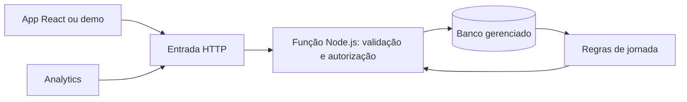

# Evolução do backend: comportamento que orienta ações

## Valor para o desafio

O Conecta relaciona um perfil fictício a sessões e eventos, interpreta esse histórico e apresenta um próximo passo explicável. Marketing e Atendimento podem investigar o contexto e organizar uma ação. A proposta responde às páginas 8 e 9 dos slides de abertura: capturar e interpretar acessos em um protótipo demonstrável com dados simulados. A página 12 avalia aderência, viabilidade e clareza do pitch.

Exemplo demonstrável: uma pessoa escolhe energia, explora oportunidades e pede ajuda duas vezes. A API recomenda orientação e explica quais eventos sustentam a sugestão. Uma conclusão demonstrativa muda o próximo passo. Desativar a coleta remove os eventos da sessão e interrompe sua personalização. Nenhum contato é enviado.

## Implementado nesta evolução

### Contexto da sessão

`GET /api/v1/sessions/:id/context` mantém `nextStep` como texto e acrescenta `recommendation`, com `rule`, `ruleVersion`, `reason`, `page`, `target` e `simulated`.

Prioridade das regras: coleta desativada → conclusão → dois cliques em ajuda → última preferência explícita válida → exploração → boas-vindas. São regras de demonstração, não diagnóstico ou previsão. A recomendação lê apenas eventos da sessão autenticada, mesmo que outras sessões usem o mesmo perfil fictício. Eventos com o mesmo horário são ordenados por id, sem alegar ordem física dos cliques.

Os campos `page` e `target` são valores do catálogo. O frontend deve mapeá-los para rotas e componentes próprios; não são URLs. A API não busca nem filtra um catálogo real de oportunidades. Para atualizar a sugestão após um clique, o cliente precisa consultar novamente o contexto.

### Sinais históricos v2

`GET /api/v2/admin/signals?from=2026-01-01&to=2026-01-10`

- `from/to/segment` selecionam os perfis com eventos no recorte.
- A evidência das regras inclui o histórico desses perfis até o fim de `to`, limitado ao instante atual.
- `evaluatedAt` registra esse instante de referência. Um filtro de janeiro não mede a inatividade usando o relógio de setembro.
- `activeNow` informa se a mesma regra continua ativa na base atual. Não é permissão de escrita nem comprovação de contato.
- `status` permanece o estado de trabalho atual, explicitado por `statusScope: current`. Não há reconstrução histórica de estados.
- `total` é calculado antes de aplicar `limit/offset`.
- Regras e histórico são recalculados sobre os eventos ainda existentes e consentidos. Eventos apagados ou recebidos posteriormente podem alterar uma consulta repetida; não é um snapshot imutável.

Exemplo: um acesso em 01/01 gera inatividade na referência 10/01. Se há uma conclusão em 20/01, a consulta histórica mantém o sinal de 10/01 e retorna `activeNow: false`. Uma conclusão anterior a `from` também é considerada para evitar falsa jornada incompleta.

A versão v1 de sinais permanece com sua semântica original, documentada em DATA-MODEL. Na revisão integrada, o Analytics consome v2 e exibe a data de referência, a atividade atual e o estado atual da ação. A API deve ser atualizada antes do painel. Atualizações continuam em `PATCH /api/v1/admin/signals/:id`, que revalida se o sinal está ativo; a leitura anterior não garante que continuará ativo na escrita. Os sinais ainda reutilizam a chave perfil:regra, sem episódios independentes.

## Relação com a stack informada pela equipe

React, Vite, Tailwind, shadcn/ui, Zod e i18next foram informados pela equipe como tecnologias do portal. Não foram confirmados por acesso ao ambiente da Petronect. O hackathon não exige essa stack.

| Parte     | Hoje no Conecta                          | Caminho de evolução                                              |
| --------- | ---------------------------------------- | ---------------------------------------------------------------- |
| App       | HTML/CSS/JS, integração em demo.html     | Usar o cliente HTTP no React; mapear catálogo para navegação     |
| API       | Node 24, Express, SQLite, execução local | Separar persistência e adaptar entrada HTTP para funções         |
| Analytics | HTML/CSS/JS, consulta API v1             | Consumir sinais v2 e mostrar referência, motivo e estado atual   |
| Validação | Catálogo validado no servidor            | Zod é opção futura; preservar validação independente do frontend |
| Idiomas   | Textos em português                      | Evoluir para códigos de mensagem traduzidos pelo i18next         |

## Arquitetura serverless proposta, ainda não implantada

Escolher uma nuvem para a primeira implantação. Usar AWS e Azure ao mesmo tempo acrescentaria operação sem demonstrar melhor o desafio.

**Opção AWS:** API Gateway + Lambda Node.js + banco gerenciado. DynamoDB é uma opção serverless, mas exige redesenhar chaves, índices, consultas por período e agregações; não substitui diretamente o SQL existente. Uma opção relacional exige adaptador assíncrono e gestão de conexões. Filas e processamento assíncrono entram quando a carga justificar.

**Opção Azure:** Azure Functions Node.js + armazenamento estruturado gerenciado, como Azure SQL ou Cosmos DB. A escolha depende do modelo de consulta e exige seu próprio adaptador de persistência.

O SQLite local, as transações síncronas e o limitador em memória tornam inadequado simplesmente publicar o servidor atual como múltiplas funções. A arquitetura futura deve externalizar o estado, manter idempotência durável por evento e tratar tentativas repetidas sem duplicar contagens. O banco atual permanece apropriado ao escopo local desta demonstração.

Referências técnicas consultadas em 15/09/2026: [desenho de aplicações Lambda](https://docs.aws.amazon.com/lambda/latest/dg/concepts-application-design.html), [boas práticas Lambda](https://docs.aws.amazon.com/lambda/latest/dg/best-practices.html), [armazenamento estruturado com Azure Functions](https://learn.microsoft.com/en-us/azure/azure-functions/concept-file-access-options). Essas referências sustentam a proposta técnica; não comprovam a arquitetura interna da Petronect.

## Próximas entregas em ordem

1. Instrumentar uma jornada real das telas do App com o catálogo existente e atualizar o contexto após cada evento aceito.
2. Validar com Marketing/Atendimento a leitura dos sinais v2 já apresentados pelo Analytics.
3. Modelar episódios de sinal e registrar responsável pela ação. Separar conclusão da tarefa de retorno observado e de impacto atribuído.
4. Definir identidade de usuário e organização antes de qualquer integração real. Hoje “perfil” é uma empresa fictícia escolhida na demo, não uma pessoa autenticada.
5. Criar adaptador de banco gerenciado, migrações e funções HTTP em uma nuvem escolhida; testar duplicatas concorrentes, persistência entre execuções e limites de carga.

## Roteiro curto de demonstração

1. Iniciar API e seed; conectar App/demo e Analytics conforme INTEGRATION.
2. Criar sessão fictícia e consultar contexto: boas-vindas.
3. Registrar preferência energia: recomendação explica o interesse declarado.
4. Registrar dois cliques em ajuda: orientação passa a ter prioridade.
5. Registrar conclusão: próximo passo reconhece a conclusão demonstrativa.
6. Desativar coleta: eventos daquela sessão são removidos e a personalização para.
7. Consultar sinais v2 para um período histórico: explicar `evaluatedAt` e `activeNow`.

Essas etapas podem ser exercitadas pelos endpoints e testes HTTP. O Analytics apresenta os sinais v2. O App original permanece sem alterações e sua demo já exibe o texto nextStep retornado pela API. Reengajamento e ganho de conversão seguem sem comprovação; o protótipo demonstra o ciclo de dados e decisão.
